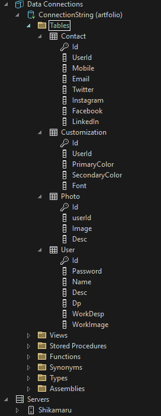

# ArtFolio

## 🧔🏽‍♀️ What is a need?

> We all know, this is a era of the online. So everyone want there small business so everyone will know about it so best way is to create the website of there business. But that application should be so simple so everyone can easily use it and make there website. So we create much simpler to use application to just fill your details and we create the website for it and also we provide the dashboard for update those details in the future and also if user not like our frontend then we also provide the api by that he can create his own front-end website.

## 🚀 Steps for running the project

1. Open `artfolio.sln` in the visual studio
2. Run it
3. Open appropriate route like `/AddUserData.aspx` for adding the data in the database.
4. Open route `/LogInForm.aspx` for login page. For admin id : `12345` and password : `12345`
5. Open `connection_test` folder in terminal by `cd connection_test`
6. Now use command `npm run dev` for running backend server
7. Now Lastly to see frontend in browser write down url `localhost:5174/:id` where id you will get when you add all you data in this form `/AddUserData.aspx`.

## 🖼️ Screen-Shots

### Adding the details

### After Adding the details

### Login Page

### Admin Dashboard

### User Dashboard

### React Frontend

### API Screenshot

### Database Screenshot

